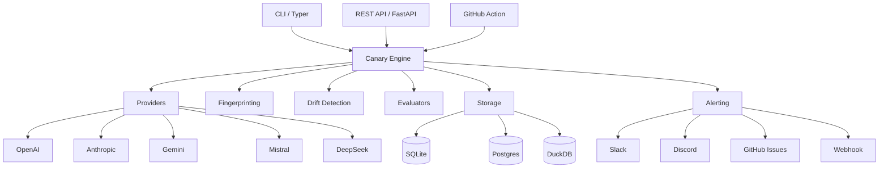

<p align="center">
  
</p>

<h1 align="center">Model Canary</h1>

<p align="center">
  <strong>Detect AI Model Drift Before Production Does</strong>
</p>

<p align="center">
  <a href="https://github.com/Hardik-369/model-canary/blob/main/LICENSE"></a>
  <a href="https://github.com/Hardik-369/model-canary/stargazers"></a>
  <a href="https://github.com/Hardik-369/model-canary/blob/main/CONTRIBUTING.md"></a>
</p>

<p align="center">
  <a href="#features">Features</a> •
  <a href="#quick-start">Quick Start</a> •
  <a href="#commands">Commands</a> •
  <a href="#examples">Examples</a> •
  <a href="#architecture">Architecture</a> •
  <a href="#deployment">Deployment</a> •
  <a href="#contributing">Contributing</a>
</p>

---

LLMs change continuously. A model may suddenly produce different outputs, change JSON formatting, become slower, become more expensive, refuse prompts, hallucinate more, lose reasoning quality, or change tool calling behavior. Developers discover this only after users complain.

**Model Canary** continuously monitors LLMs and immediately alerts developers when meaningful behavioral changes occur.

## Features

### Multi-Provider Support
OpenAI, Anthropic, Google Gemini, Mistral, DeepSeek, Grok, Cohere, OpenRouter, Together AI, Fireworks AI, Azure OpenAI, Ollama, vLLM, LM Studio, LiteLLM Gateway, and custom REST APIs.

### Drift Detection
- ✓ Output Drift
- ✓ Latency Drift
- ✓ Cost Drift
- ✓ Reasoning Drift
- ✓ Tool Calling Drift
- ✓ JSON Schema Drift
- ✓ Refusal Drift
- ✓ Token Usage Drift
- ✓ Semantic Drift
- ✓ Structural Drift

### Prompt Test Suites
Organize prompts into categories: `coding/`, `json/`, `reasoning/`, `agents/`, `rag/`, `security/`. Each prompt can have expected outputs, schemas, evaluators, and severity levels.

### Fingerprinting Engine
Never compare raw text. Generate fingerprints using SHA256, embeddings (Sentence Transformers), cosine similarity, token counts, latency, cost, response structure, JSON schema, markdown structure, tool calls, function calls, stop reason, and refusal detection.

### Alerting
Slack, Discord, GitHub Issues, webhooks, email, PagerDuty, OpsGenie, Telegram, and Microsoft Teams.

### Beautiful CLI
18+ commands powered by Typer and Rich with progress bars, tables, panels, and syntax highlighting.

### REST API
Full FastAPI backend with Swagger documentation, OpenAPI spec, authentication, pagination, filtering, rate limiting, metrics, and health endpoints.

### Dashboard
Modern dark-mode web dashboard with charts for latency, cost, similarity, failures, drift timeline, provider health, prompt health, token usage, model comparison, and historical trends.

### Plugin System
Build custom providers, evaluators, alerters, storage backends, and report generators.

### Storage
SQLite (default), PostgreSQL, DuckDB, MongoDB, local JSON, S3, GCS, and Azure Blob.

### Docker & Kubernetes
Ready for production deployment with Docker, Docker Compose, and Kubernetes manifests.

## Quick Start

```bash
# Install
pip install model-canary

# Initialize a project
model-canary init

# Set your API keys
export OPENAI_API_KEY="sk-..."
export ANTHROPIC_API_KEY="sk-ant-..."

# Run canary tests
model-canary run

# View the dashboard
model-canary dashboard
```

### Using Docker

```bash
docker run -p 8311:8311 \
  -e OPENAI_API_KEY="sk-..." \
  -v $(pwd)/config:/etc/model-canary \
  ghcr.io/Hardik-369/model-canary:latest
```

### Using Docker Compose

```bash
git clone https://github.com/Hardik-369/model-canary.git
cd model-canary
docker compose up
```

## Configuration

Create a `model-canary.yml` file:

```yaml
version: "1"
project_name: my-project

providers:
  - name: openai
    type: openai
    api_key: ${OPENAI_API_KEY}
    default_model: gpt-4o
    models:
      - gpt-4o
      - gpt-4o-mini

  - name: anthropic
    type: anthropic
    api_key: ${ANTHROPIC_API_KEY}
    default_model: claude-3-5-sonnet-20241022

test_suites:
  - name: production
    schedule: "*/30 * * * *"
    prompts:
      - name: json-output
        prompt: "Return a JSON object with keys: name, age, email"
        category: json
        severity: high
        evaluators:
          - json

storage:
  backend: sqlite
  connection_string: sqlite+aiosqlite:///model_canary.db

alerting:
  enabled: true
  channels:
    - slack
    - discord
  min_severity: medium
```

## Commands

| Command | Description |
|---------|-------------|
| `init` | Initialize a new Model Canary project |
| `run` | Run canary test suites |
| `list` | List configured providers and suites |
| `compare` | Compare fingerprints across providers |
| `report` | Generate drift reports (HTML, Markdown, JSON) |
| `dashboard` | Start the web dashboard |
| `history` | Show drift report history |
| `inspect` | Inspect a specific fingerprint |
| `doctor` | Check system health |
| `benchmark` | Benchmark models against each other |
| `config` | View or validate configuration |
| `providers` | List available providers |
| `models` | List models for a provider |
| `alerts` | View or test alert configuration |
| `diff` | Compare two runs |
| `prompts` | Manage prompts |
| `watch` | Continuous watch mode |

## Examples

### Benchmark Models

```bash
model-canary benchmark "Write a fibonacci function in Python" \
  --model gpt-4o \
  --model claude-3-5-sonnet-20241022 \
  --model gemini/gemini-pro
```

### Compare Providers

```bash
model-canary compare json-output openai anthropic
```

### Continuous Monitoring

```bash
model-canary watch --interval 300
```

### API Usage

```bash
# Start the API server
model-canary dashboard --port 8311

# Execute a prompt via API
curl -X POST "http://localhost:8311/api/v1/run/prompt" \
  -H "Content-Type: application/json" \
  -d '{"prompt": "Return JSON with name and age", "provider": "openai"}'

# Get drift reports
curl "http://localhost:8311/api/v1/drifts?severity=critical"

# View stats
curl "http://localhost:8311/api/v1/stats"
```

### GitHub Actions

```yaml
name: Model Canary
on:
  schedule:
    - cron: "*/30 * * * *"
  workflow_dispatch:

jobs:
  canary:
    runs-on: ubuntu-latest
    steps:
      - uses: actions/checkout@v4
      - uses: model-canary/action@v1
        with:
          config: model-canary.yml
          openai-api-key: ${{ secrets.OPENAI_API_KEY }}
          anthropic-api-key: ${{ secrets.ANTHROPIC_API_KEY }}
```

## Architecture



## Supported Providers

| Provider | Type | Default Model |
|----------|------|---------------|
| OpenAI | `openai` | gpt-4o |
| Anthropic | `anthropic` | claude-3-5-sonnet-20241022 |
| Google Gemini | `gemini` | gemini-pro |
| Mistral | `mistral` | mistral-large-latest |
| DeepSeek | `deepseek` | deepseek-chat |
| Grok (xAI) | `grok` | grok-2 |
| Cohere | `cohere` | command-r-plus |
| OpenRouter | `openrouter` | openai/gpt-4o |
| Together AI | `together` | Mixtral-8x7B |
| Fireworks AI | `fireworks` | llama-v3p1-8b |
| Azure OpenAI | `azure_openai` | gpt-4o |
| Ollama | `ollama` | llama2 |
| vLLM | `vllm` | gpt-3.5-turbo |
| LM Studio | `lm_studio` | gpt-3.5-turbo |
| LiteLLM | `litellm` | gpt-4o |
| Custom | `custom` | configurable |

## Evaluators

| Evaluator | Description |
|-----------|-------------|
| `json` | Validate JSON output against schema |
| `regex` | Match output against regex patterns |
| `similarity` | Embedding-based semantic similarity |
| `exact_match` | Exact string comparison |
| `contains` | Check for required/forbidden substrings |
| `python` | Custom Python assertion code |
| `llm_judge` | LLM-as-judge evaluation |
| `bleu` | BLEU score for translation quality |
| `rouge` | ROUGE score for summarization quality |

## Storage Backends

| Backend | Connection String |
|---------|------------------|
| SQLite | `sqlite+aiosqlite:///model_canary.db` |
| PostgreSQL | `postgresql+asyncpg://localhost:5432/model_canary` |
| DuckDB | `duckdb:///model_canary.duckdb` |
| Local JSON | (file-based, no connection string) |

## Alerting Channels

| Channel | Configuration |
|---------|--------------|
| Slack | Webhook URL |
| Discord | Webhook URL |
| GitHub Issues | Token + Repo |
| Webhook | URL + optional HMAC secret |
| Log | Built-in (always enabled) |

## Project Status

Model Canary is in active development. The core features are stable and ready for use.

### Roadmap

- [x] Multi-provider support
- [x] Prompt test suites
- [x] Fingerprinting engine
- [x] Drift detection engine
- [x] CLI
- [x] REST API
- [x] Dashboard
- [x] Plugin system
- [x] Docker/Kubernetes support
- [ ] Grafana dashboard
- [ ] React/Next.js dashboard
- [ ] Langfuse integration
- [ ] Helicone integration
- [ ] Custom metrics exporters
- [ ] Advanced benchmarking suite
- [ ] Regression testing mode
- [ ] Model comparison reports
- [ ] Cost optimization suggestions
- [ ] Anomaly detection using ML

## Contributing

We welcome contributions! See [CONTRIBUTING.md](CONTRIBUTING.md) for details.

1. Fork the repository
2. Create a feature branch
3. Make your changes
4. Run tests: `uv run pytest`
5. Submit a pull request

## License

Apache 2.0

## Support

- [Documentation](https://docs.modelcanary.dev)
- [Discord Community](https://discord.gg/modelcanary)
- [GitHub Issues](https://github.com/Hardik-369/model-canary/issues)
- [Twitter](https://twitter.com/modelcanary)

---

<p align="center">
  Made with ❤️ by the Model Canary Team
</p>
