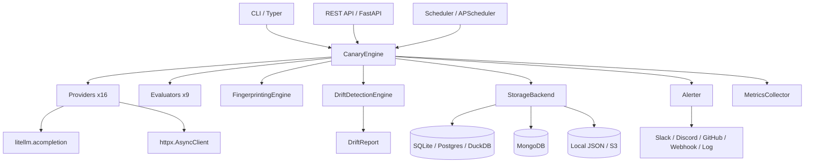

<p align="center">
  <picture>
    <source media="(prefers-color-scheme: dark)" srcset="https://raw.githubusercontent.com/Hardik-369/model-canary/main/assets/logo-dark.svg">
    
  </picture>
</p>

<h1 align="center">Model Canary</h1>

<p align="center">
  <em>Detect AI Model Drift Before Production Does</em>
</p>

<p align="center">
  <a href="https://github.com/Hardik-369/model-canary/blob/main/LICENSE"></a>
  <a href="https://github.com/Hardik-369/model-canary/stargazers"></a>
  <a href="https://github.com/Hardik-369/model-canary/blob/main/CONTRIBUTING.md"></a>
  <a href="#"></a>
</p>

<p align="center">
  <a href="#features">Features</a> •
  <a href="#quick-start">Quick Start</a> •
  <a href="#cli">CLI</a> •
  <a href="#api">API</a> •
  <a href="#architecture">Architecture</a> •
  <a href="#configuration">Configuration</a>
</p>

---

LLMs change without notice. A model may silently alter its output format, refuse prompts it used to answer, double its latency, or degrade in reasoning quality — and the first sign is often a user complaint.

**Model Canary** is an open-source observability layer for LLMs that continuously runs prompt suites, fingerprints responses, compares them against baselines, and alerts you the moment meaningful behavioral drift appears.

---

## Features

### Multi-Provider Engine
16 providers across a unified interface — OpenAI, Anthropic, Gemini, Mistral, DeepSeek, Grok, Cohere, OpenRouter, Together AI, Fireworks AI, Azure OpenAI, Ollama, vLLM, LM Studio, LiteLLM gateway, and custom OpenAI-compatible endpoints.

### Drift Detection (10 Types)
| Drift | What It Detects |
|---|---|
| Output | Response content hash mismatch |
| Semantic | Cosine similarity below threshold |
| Structural | Markdown / response structure change |
| Latency | Response time deviation >2x |
| Cost | Token cost deviation >2x |
| Refusal | Model starts or stops refusing prompts |
| Tool Calling | Function call pattern changes |
| JSON Schema | JSON structure / keys change |
| Token Usage | Token count changes >5x |
| Reasoning | Reasoning token volume changes |

### Fingerprinting Engine
Each response is reduced to a fingerprint — SHA-256 hash, optional SentenceTransformer embedding, JSON schema hash, markdown structure signature, token counts, latency, cost, tool call signatures, and refusal flags. Baselines are stored and compared on every subsequent run.

### Evaluators (9 Types)
`json` • `regex` • `similarity` • `exact_match` • `contains` • `python` • `llm_judge` • `bleu` • `rouge`

Validate outputs through JSON schema conformance, regex patterns, semantic similarity, BLEU/ROUGE scores, custom Python assertions, or an LLM-as-judge.

### Alerting Channels
Slack, Discord, GitHub Issues, webhook (with HMAC signing), and console log — each with configurable severity thresholds and rate limiting.

### Storage Backends
SQLite (default), PostgreSQL, DuckDB, MongoDB, local JSON files, and S3 — all behind a uniform `StorageBackend` interface.

### REST API
FastAPI server with 16 endpoints covering runs, drifts, fingerprints, execution, benchmarking, comparison, stats, provider listing, and an embedded dark-mode dashboard with live drift monitoring.

### CLI
17 commands via Typer with Rich-formatted tables, progress bars, panels, and color-coded output.

### Plugin System
Extend providers, evaluators, alerters, and storage backends through Python entry points.

### Scheduler
Cron and interval-based scheduling via APScheduler for continuous monitoring.

### Prometheus Metrics
Built-in metrics collection for runs, drifts, latency, cost, tokens, refusals, and provider health.

---

## Quick Start

```bash
pip install model-canary

model-canary init my-project
cd my-project

export OPENAI_API_KEY="sk-..."
export ANTHROPIC_API_KEY="sk-ant-..."

model-canary run

model-canary dashboard
```

### Docker

```bash
docker run -p 8311:8311 \
  -e OPENAI_API_KEY="sk-..." \
  -v $(pwd)/config:/etc/model-canary \
  ghcr.io/Hardik-369/model-canary:latest
```

---

## CLI

```bash
model-canary init          # Scaffold a new project
model-canary run           # Execute all prompt suites
model-canary list          # Show recent run results
model-canary compare       # Compare fingerprints across providers
model-canary report        # Generate drift report (json/md/html/csv)
model-canary dashboard     # Start the web dashboard
model-canary history       # Browse drift report history
model-canary inspect       # Inspect a specific fingerprint
model-canary doctor        # Validate configuration and provider health
model-canary benchmark     # Benchmark models side-by-side
model-canary config        # View or validate configuration
model-canary providers     # List all registered providers
model-canary models        # List models for a provider
model-canary alerts        # Configure and test alerts
model-canary diff          # Compare two run results
model-canary prompts       # Manage prompt definitions
model-canary watch         # Continuous monitoring mode
```

Executing a prompt suite:
```bash
model-canary run --suite production
```

Benchmarking models:
```bash
model-canary benchmark "Write a fibonacci function" \
  --model gpt-4o \
  --model claude-3-5-sonnet-20241022
```

---

## API

Start the server:
```bash
model-canary dashboard --port 8311
```

| Method | Endpoint | Description |
|--------|----------|-------------|
| GET | `/health` | Service health |
| GET | `/api/v1/runs` | List runs |
| GET | `/api/v1/runs/{id}` | Get run details |
| GET | `/api/v1/drifts` | List drift reports (filterable) |
| GET | `/api/v1/drifts/{id}` | Get drift details |
| GET | `/api/v1/fingerprints` | List fingerprints |
| POST | `/api/v1/execute` | Run all suites |
| POST | `/api/v1/execute/suite` | Run one suite |
| POST | `/api/v1/execute/prompt` | Run one prompt |
| POST | `/api/v1/benchmark` | Benchmark models |
| POST | `/api/v1/compare` | Compare two runs |
| GET | `/api/v1/stats` | Aggregate statistics |
| GET | `/api/v1/providers` | List providers |
| GET | `/api/v1/prompts` | List prompts |
| GET | `/dashboard` | Web dashboard |
| GET | `/docs` | Swagger UI |

```bash
curl -X POST "http://localhost:8311/api/v1/execute/prompt" \
  -H "Content-Type: application/json" \
  -d '{"prompt": "Classify this sentiment", "provider": "openai"}'

curl "http://localhost:8311/api/v1/drifts?severity=high"
```

---

## Architecture



### Data Flow

```
Prompt Suite
  → For each (provider × prompt):
    → provider.complete() → PromptResult
    → fingerprinting_engine.fingerprint() → Fingerprint
    → storage.get_latest_fingerprint() → baseline
    → if baseline exists:
        → drift_detection_engine.detect(baseline, current) → DriftReport[]
        → storage.save_drift_report(report)
        → if report.severity ≥ threshold:
            → alerter.send_alert(report)
    → storage.save_run_result(result)
    → storage.save_fingerprint(fingerprint)
```

---

## Configuration

```yaml
version: "1"
project_name: my-app

providers:
  - name: openai
    type: openai
    api_key: ${OPENAI_API_KEY}
    default_model: gpt-4o

  - name: anthropic
    type: anthropic
    api_key: ${ANTHROPIC_API_KEY}
    default_model: claude-3-5-sonnet-20241022

test_suites:
  - name: production
    schedule: "*/30 * * * *"
    prompts:
      - name: json-output
        prompt: "Return JSON with keys: name, age, email"
        category: json
        severity: high
        evaluators:
          - json
      - name: classify-sentiment
        prompt: "Classify as positive/negative/neutral: {input}"
        evaluators:
          - exact_match

storage:
  backend: sqlite
  connection_string: sqlite+aiosqlite:///model_canary.db

alerting:
  enabled: true
  channels:
    - slack
    - discord
  min_severity: medium
  max_alerts_per_run: 5
```

---

## Supported Providers

| Provider | Config Type | Default Model |
|----------|-------------|---------------|
| OpenAI | `openai` | gpt-4o |
| Anthropic | `anthropic` | claude-3-5-sonnet-20241022 |
| Google Gemini | `gemini` | gemini-pro |
| Mistral | `mistral` | mistral-large-latest |
| DeepSeek | `deepseek` | deepseek-chat |
| Grok (xAI) | `grok` | grok-2 |
| Cohere | `cohere` | command-r-plus |
| OpenRouter | `openrouter` | openai/gpt-4o |
| Together AI | `together` | Mixtral-8x7B |
| Fireworks AI | `fireworks` | llama-v3p1-8b |
| Azure OpenAI | `azure_openai` | gpt-4o |
| Ollama | `ollama` | llama2 |
| vLLM | `vllm` | gpt-3.5-turbo |
| LM Studio | `lm_studio` | gpt-3.5-turbo |
| LiteLLM | `litellm` | gpt-4o |
| Custom API | `custom` | configurable |

---

## Storage Backends

| Backend | Connection String |
|---------|------------------|
| SQLite | `sqlite+aiosqlite:///model_canary.db` |
| PostgreSQL | `postgresql+asyncpg://host:5432/model_canary` |
| DuckDB | `duckdb:///model_canary.duckdb` |
| MongoDB | `mongodb://localhost:27017/model_canary` |
| Local JSON | file-based (no connection string) |
| S3 | `s3://bucket-name` |

---

## Contributors

Model Canary is open source under the Apache 2.0 license. Contributions are welcome — see [CONTRIBUTING.md](CONTRIBUTING.md) to get started.

<p align="center">
  <sub>Built with Python 3.13, FastAPI, Typer, LiteLLM, and SQLAlchemy.</sub>
</p>
