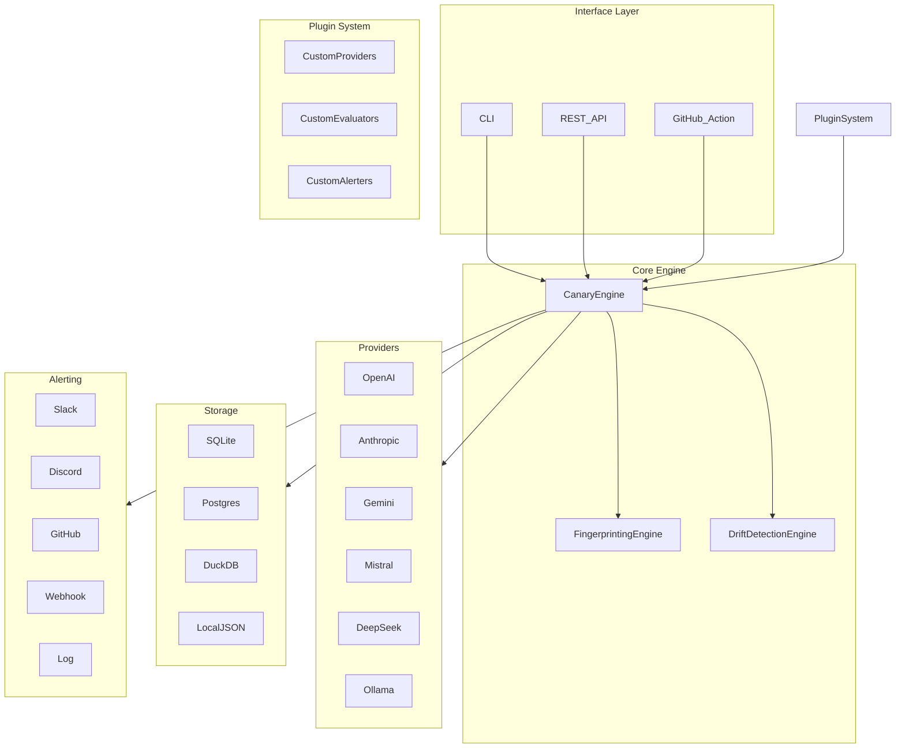

# Architecture

Model Canary follows a clean, modular architecture with separation of concerns.

## Design Principles

- **Modular** — Each component is independent and replaceable
- **Provider Agnostic** — Add any LLM provider via one interface
- **Plugin Based** — Extend functionality without modifying core
- **Privacy First** — All data stays local by default
- **Production Ready** — Built for real-world deployment
