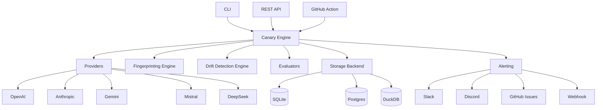

# Model Canary

**Detect AI Model Drift Before Production Does**

Model Canary continuously monitors LLMs and alerts you when meaningful behavioral changes occur in your AI models.

## Key Features

- **Multi-Provider Support** — OpenAI, Anthropic, Google Gemini, Mistral, DeepSeek, Grok, Cohere, OpenRouter, Ollama, and more
- **Prompt Test Suites** — Organize prompts by category (coding, JSON, reasoning, security, etc.)
- **Fingerprinting Engine** — Generate SHA256, embeddings, cosine similarity, token counts, latency, cost, and structure fingerprints
- **Drift Detection** — Detect output, semantic, structural, latency, cost, refusal, tool calling, JSON schema, and token usage drift
- **Alerting** — Slack, Discord, GitHub Issues, webhooks, and more
- **Beautiful CLI** — Rich-powered CLI with 18+ commands
- **REST API** — Full FastAPI backend with Swagger documentation
- **Dashboard** — Modern dark-mode UI with charts and metrics
- **Plugin System** — Extend with custom providers, evaluators, alerters, and storage backends
- **Docker & Kubernetes** — Ready for production deployment

## Quick Start

```bash
# Install
pip install model-canary

# Initialize a project
model-canary init

# Set your API key
export OPENAI_API_KEY="sk-..."

# Run canary tests
model-canary run

# Start the dashboard
model-canary dashboard
```

## Supported Providers

| Provider | Status |
|----------|--------|
| OpenAI | ✅ |
| Anthropic | ✅ |
| Google Gemini | ✅ |
| Mistral | ✅ |
| DeepSeek | ✅ |
| Grok (xAI) | ✅ |
| Cohere | ✅ |
| OpenRouter | ✅ |
| Together AI | ✅ |
| Fireworks AI | ✅ |
| Azure OpenAI | ✅ |
| Ollama | ✅ |
| vLLM | ✅ |
| LM Studio | ✅ |
| LiteLLM Gateway | ✅ |
| Custom REST API | ✅ |

## Architecture



## License

Apache 2.0
